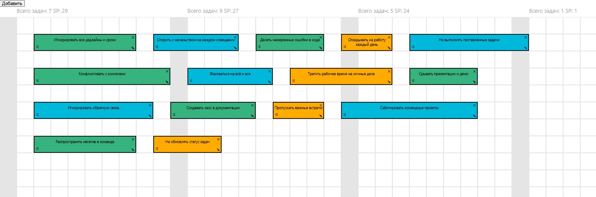

# TechnoPlanner



[](https://reactjs.org/)
[](https://expressjs.com/)
[](https://nodejs.org/)

Интерактивное веб-приложение для планирования и распределения задач по спринтам в стиле Scrum. Позволяет визуально управлять задачами с помощью drag-and-drop интерфейса.

## ✨ Возможности

- **Визуальное планирование**: Перетаскивайте задачи на временной шкале
- **Управление весом задач**: Изменяйте продолжительность задач с помощью колесика мыши
- **Типы задач**: Классифицируйте задачи по типам (Тип1, Тип2, Тип3)
- **Предотвращение конфликтов**: Автоматическое разрешение пересечений задач
- **Автосохранение**: Данные сохраняются автоматически на сервере
- **Статистика спринтов**: Отображение количества задач и story points по спринтам
- **Редактирование на месте**: Двойной клик для редактирования задач

## 🚀 Быстрый старт

### Предварительные требования

- Node.js (версия 16 или выше)
- npm или yarn

### Установка

1. Клонируйте репозиторий:
```bash
git clone <repository-url>
cd technoplanner
```

2. Установите зависимости для фронтенда:
```bash
npm install
```

3. Установите зависимости для бэкенда:
```bash
cd backend
npm install
cd ..
```

### Запуск

1. Запустите бэкенд-сервер:
```bash
cd backend
node technoplanner.js
```

Сервер запустится на `http://localhost:9000`

2. В новом терминале запустите фронтенд:
```bash
npm start
```

Приложение откроется в браузере на `http://localhost:3000`

## 📖 Использование

### Добавление задач
- Нажмите кнопку "Добавить" в левом верхнем углу
- Новая задача появится на экране

### Перемещение задач
- Перетащите задачу за угол (⤭) или за основную область
- Задачи автоматически выравниваются по сетке 50px

### Изменение размера
- Наведите курсор на задачу и используйте колесико мыши
- Вверх - увеличить размер, вниз - уменьшить

### Редактирование задач
- Кликните на иконку ✎ для редактирования текста и типа задачи
- Нажмите Enter для сохранения изменений

### Удаление задач
- Кликните на крестик ⨉ в правом верхнем углу задачи
- Подтвердите удаление в диалоговом окне

## 🏗️ Архитектура

### Фронтенд (React)
- **App.js**: Основной компонент приложения
- **CalendarBG.js**: Фон календаря с сеткой и статистикой
- **TimeElement.js**: Компонент отдельной задачи

### Бэкенд (Express.js)
- **technoplanner.js**: Сервер с REST API
- **data.json**: Хранение данных задач

### API Endpoints
- `GET /getSchedule` - Получение всех задач
- `POST /saveSchedule` - Сохранение всех задач

## 🎨 Цветовая схема

- **Тип1**: Зеленый (#36B37E)
- **Тип2**: Голубой (#00B8D9)
- **Тип3**: Оранжевый (#FFAB00)

## 📊 Формат данных

Каждая задача хранится в формате:
```json
{
  "uuid": {
    "value": "Название задачи",
    "x": 100,
    "y": 200,
    "weight": 150,
    "type": "Тип1"
  }
}
```

- `x`, `y`: Координаты на экране
- `weight`: Вес задачи (в пикселях, соответствует времени)
- `type`: Тип задачи

## 🔧 Разработка

### Структура проекта
```
technoplanner/
├── backend/
│   ├── technoplanner.js    # Сервер Express
│   ├── package.json        # Зависимости бэкенда
│   └── data.json          # Данные задач
├── src/
│   ├── App.js             # Главный компонент
│   ├── App.css            # Стили
│   └── Components/
│       ├── CalendarBG.js  # Фон календаря
│       └── TimeElement.js # Компонент задачи
├── public/
├── build/                 # Собранный фронтенд
└── package.json           # Зависимости фронтенда
```

### Используемые технологии
- **Frontend**: React 18, React DnD, Axios
- **Backend**: Express.js, CORS
- **Data Storage**: JSON file (для простоты)

## 🤝 Вклад в проект

1. Форкните проект
2. Создайте ветку для вашей фичи (`git checkout -b feature/AmazingFeature`)
3. Зафиксируйте изменения (`git commit -m 'Add some AmazingFeature'`)
4. Отправьте в ветку (`git push origin feature/AmazingFeature`)
5. Откройте Pull Request

## 📄 Лицензия

Этот проект распространяется под лицензией MIT. См. файл `LICENSE` для подробностей.

## 📞 Контакты

Если у вас есть вопросы или предложения, создайте issue в репозитории.

